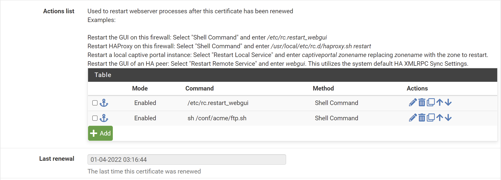

# Local distribution of centrally managed SSL Certs

A script that helps distribute/update local SSL certs from a centrally
managed remote location via SCP or FTP. This allows reducing exposure
to external services by retrieving SSL (wildcard) certificates from a single
(centrally managed) ACME instance (e.g.) or a pfsense/opnsense box. Useful
for local network Split-Brain-DNS Setups or for Demilitarized Zones (DMZ).

## Requirements

```
apt-get install ftp openssl sshpass
```

Note:  
- `ftp` is only needed if not using `scp`.
- `sshpass` is only needed when using `scp` with a (password protected) keyfile

## Setup


- Console

```sh
cd /etc/nginx/
# or /etc/apache2/
mkdir ssl
apt-get install ftp # if using ftp
git clone git@github.com:Sieboldianus/ssl_get.git
cd ssl_get
chmod +x check_cert.sh ftp.sh scp.sh
cp .env.example .env
nano .env
```

Change the parameters in `.env` to your needs.

It is possible to define any after-script-hook 
in `.env` such as reload service nginx, apache, 
or docker restart. The command must be defined as 
a variable `RESTART_CMD` that will be executed via 
via `/bin/bash` in `check_cert.sh`. 

Test script:
```sh
sh check_cert.sh
```

## Cron


Add cron:
```sh
sudo crontab -e
```

Add lines:
```sh
5 8 * * 0 /etc/nginx/ssl_get/check_cert.sh
```

This will verify expiration of local SSL certs once a week at 08:05
and pull new certificates from the remote location, if expiring 
within the next 14 days. Adjust this default time buffer in [check_cert.sh](check_cert.sh).

Use (e.g.) [crontab.guru](https://crontab.guru/#5_8_*_*_*) to change
frequency/ timespan. If you have multiple servers pulling certificates
and if you are using FTP, provide some variance to avoid FTP Error 421 
(Too many simultaneous connections).

## pfsense/opnsense integration

This is not related to this script in particular.

To store your wildcard certificates from the ACME script on pfsense or 
opnsense in a remote folder, go to Services > Acme Certificates and click 
on Edit SSL Certificate.

1. Under Action list, add an action after "/etc/rc.restart_webgui" with the 
following target
```
sh /conf/acme/ftp.sh
```
2. Create this script, to forward SSL certs to the central remote folder, e.g.
```sh
ftp -n $HOST <<END_SCRIPT
quote USER $USER
quote PASS $PASSWD
binary
cd certs
prompt
mput $FILE
quit
END_SCRIPT
exit 0
```

<details><summary>Screenshot</summary>



</details>


## Debug

Inspect crontab logs
```sh
sudo find /var/log/. -name \syslog.*.gz -print0 | xargs -0 zgrep "check_cert.sh"
# or individual
sudo grep "check_cert.sh" /var/log/syslog
sudo grep "check_cert.sh" /var/log/syslog.1
sudo zgrep "check_cert.sh" /var/log/syslog.2.gz
> Mar 21 08:05:01 cloud CRON[25307]: (root) CMD (/etc/nginx/check_cert.sh)
...
```

Also, check mail:
```
mail
```

<details><summary>Example</summary>

```output
Message 1:
From root@service  Sun Aug 29 08:05:02 2021
X-Original-To: root
From: root@service (Cron Daemon)
To: root@service
Subject: Cron <root@service> /etc/apache2/ssl_get/check_cert.sh
MIME-Version: 1.0
Content-Type: text/plain; charset=US-ASCII
Content-Transfer-Encoding: 8bit
X-Cron-Env: <SHELL=/bin/sh>
X-Cron-Env: <HOME=/root>
X-Cron-Env: <PATH=/usr/bin:/bin>
X-Cron-Env: <LOGNAME=root>
Date: Sun, 29 Aug 2021 08:05:02 +0200 (CEST)

Checking SSL expiration date of wildcard.local.mytld.com.fullchain..
/etc/apache2/ssl/wildcard.local.mytld.com.fullchain
Expiration date not yet reached (notAfter=Sep  9 00:16:51 2021 GMT)
```

</details>

Test all crontab entries:
```sh
crontab -l | grep -v '^#' | cut -f 6- -d ' ' | while read CMD; do eval $CMD; done
```

Check expiration of web address manually:
```sh
openssl s_client \
    -servername service.local.mytld.com \
    -connect service.local.mytld.com:443 | openssl x509 -noout -dates
```

Check SSL cert:
```sh
openssl s_client \
    -showcerts -connect service.local.mytld.com:443 </dev/null
```